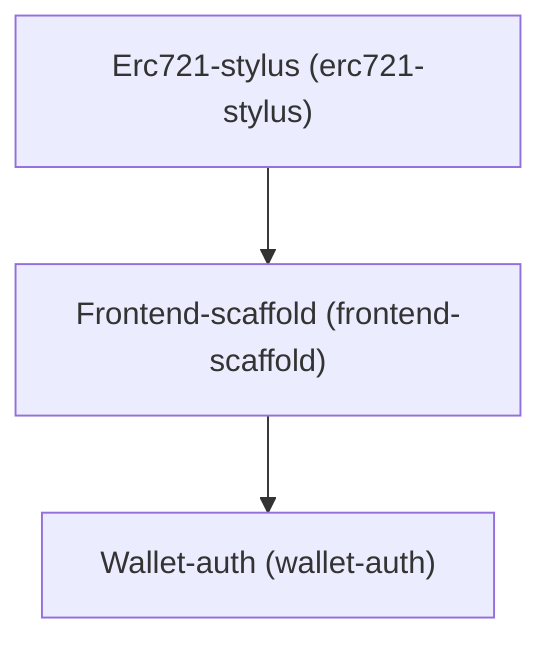

# Architecture

## Dependency Graph

```mermaid
graph TD
  606a2f9e["Erc721-stylus (erc721-stylus)"]
  d1e4ec9f["Frontend-scaffold (frontend-scaffold)"]
  bb9534d2["Wallet-auth (wallet-auth)"]
  606a2f9e --> d1e4ec9f
  d1e4ec9f --> bb9534d2
```

## Execution / Implementation Order

1. **Erc721-stylus** (`606a2f9e`)
2. **Frontend-scaffold** (`d1e4ec9f`)
3. **Wallet-auth** (`bb9534d2`)
